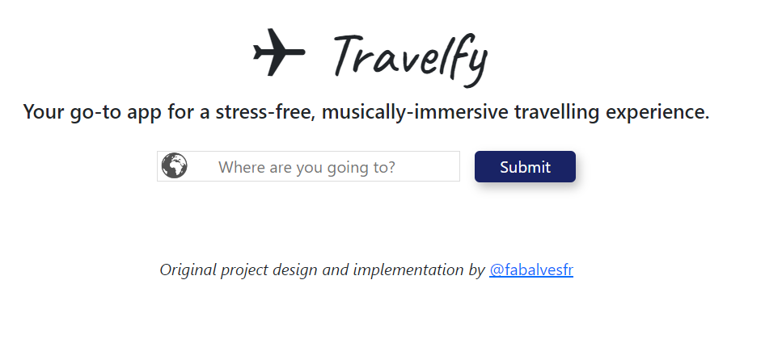
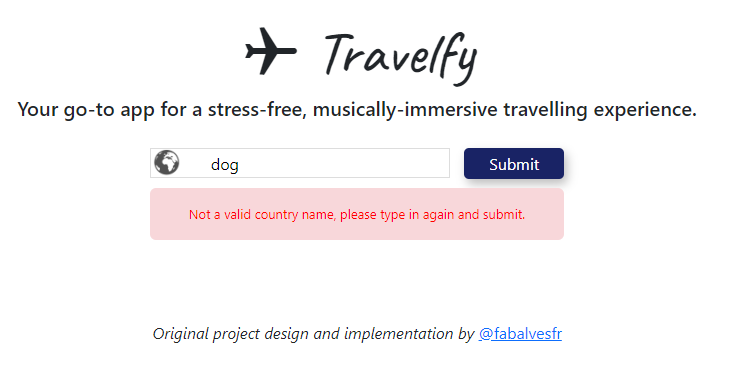
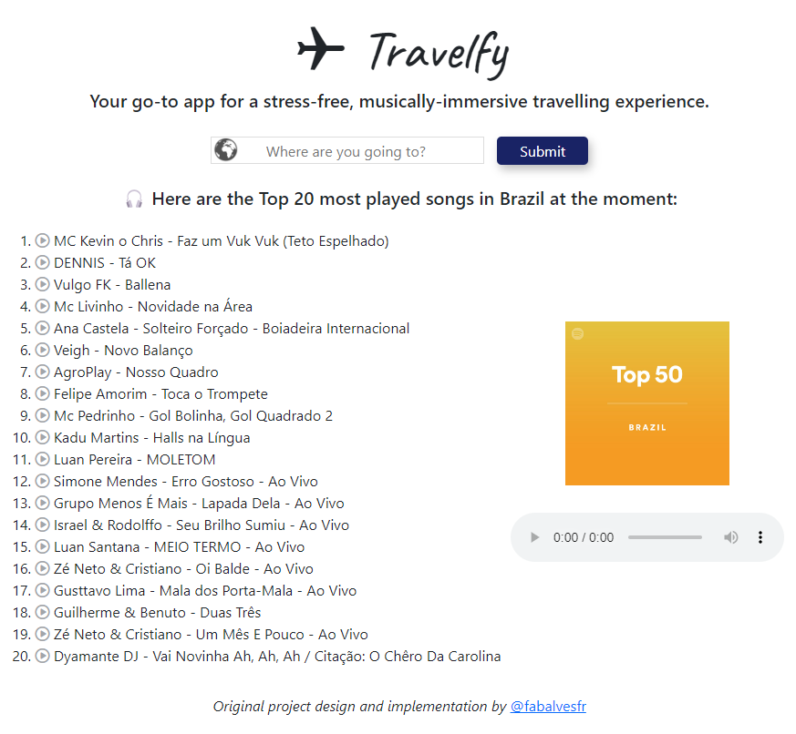
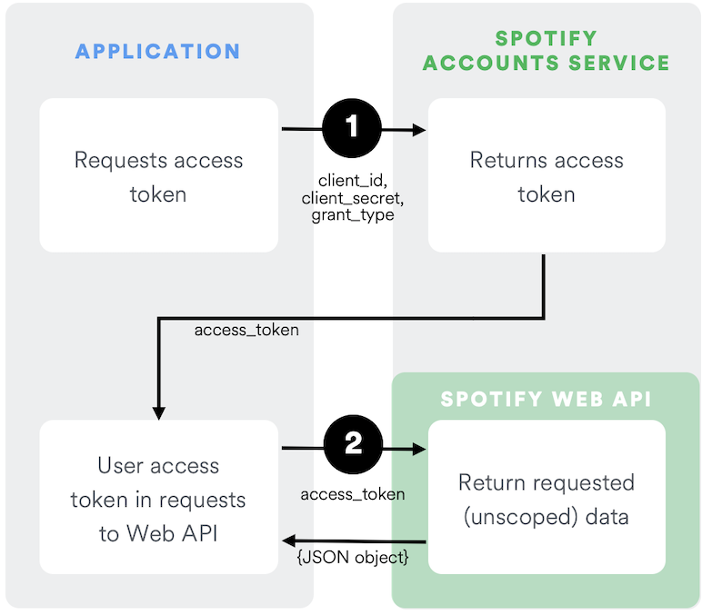

# ✈ Travelfy
_Designed and implemented by Fabio FERNANDES ALVES_

Amiens, France - August 2023
## 📹 Video Demo:  <(https://www.youtube.com/watch?v=mga2PXSV8jQ)>
## 🗣 Description
### 📖 User story
---
We all know the most stressful part of a trip is its preparation: searching for tickets with the best cost benefit, packing the luggage and making sure it’s not oversized or overweight, planning the commute to the airport, going through customs and getting to the boarding gate on time.. 🥵 Ouf, we haven’t even got to our destination yet and we feel like we need a break from our own vacations!

Travelfy was designed to make the traveler experience more enjoyable and pleasing from the moment one’s chosen one’s destination 😌🍃

On the click of a button, Travelfy returns you a custom playlist of the Top 20 most played songs in your country’s destination! That way, you can start enjoying your vacations long before the plane lands on your destination, while you pack your bags, commute to the airport, or walk through the duty-free 😉 Close your eyes, listen to the music and have a full-on musically immersive experience.. 🎧🎶
### 📱App features
---
#### 👤 UI/UX features
The application frontend is composed of the following features:
- __A form__, composed of an _input box_, where the user types in his country's destination; and a _submit button_, which, as the name suggests, submits the form via a POST request to the backend (Python/Flask) that will handle the appropriate logic

    

    _Figure 1_: Travelfy home page in its initial state.

- __An alert message__, which appears right under the input box, on the event of the user typing an invalid country name

    

    _Figure 2_: Alert message after invalid form submission.

    After valid form submission:

- __A custom list__ of the top 20 most played songs (track name and artist) in the country after form submition by user
- __A clickable play icon__ right next to each song through which the user can hear a 30s preview of that song
- __A custom playlist cover__ image
- __A media player__ that allows the user to play/stop the current track and adjust the volume

    

    _Figure 3_: Travelfy home page after valid form submission.

#### 🧰 Tech stack
##### ▪️ HMTL
---
The HTML template was structured using HTML5 boilerplate:
* __HMTL__:
    * __Head__: meta tags for responsiveness, as well as link tags linking the html file to CSS and Bootstrap
    * __Body__:
        - _Header_: contains the app name and solgan
        - _Main cointainer_: styled using Flexbox model, it contains a top section, where the form is; and a bottom section, with a bottom-left section, for the tracks list and a bottom-right section, where the playlist cover image and the media player are
        - _Footer_: author credits
        - _Script tags_: links the HTML to JavaScript and Bootstrap

##### ▪️ CSS
---
* __Layout__: HTML elements were designed on the page using _Flexbox_ model
* __Responsive design__: the application was responsively designed according to _web-first_ approach: as the screen size decreases and reach 640px - corresponding to a transition from desktop to a mobile display - a media query changes the app layout: the playlist cover and the media player, originally beside the tracks list, go right underneath it, so those elements do not overlap each other as the screen size decreases
* __Animation__: the app name, Travelfy, on the very top of the page, is styled with a "slide-in" animation upon page load using @keyframe rule and CSS animation property

##### ▪️ JavaScript
---

JavaScript role was basically to integrate 2 functionalities into the application on the form of __Event Listeners__:
* _Click events_ on each of the play icons that basically gets the url encoded as a _data-*_ attribute in each of those icons (which is in fact a link to a 30s preview url in MP3 format), sets the _src_ attribute of the _audio_ tag with that url and plays it.
* _Submit event_ that compares the country provided as input by the user and an array of countries encoded as a _data-*_ attribute in the _p_ tag named as "alert-message". If the user provides an invalid input (such as "cat", or "123"), JavaScript unhides the alert message, as well as prevents the form from being submitted

##### ▪️ Python
---

Python was chosen as backend language to handle all the logic necessary to process information coming from the frontend, as well as for communicating with Spotify server through its different API endpoints. More specifically, the access token request followed Spotify's _Client Credentials Flow_:

_Figure 4_: Spotify Client Credentials Flow (source: [https://developer.spotify.com/documentation/web-api/tutorials/client-credentials-flow](https://developer.spotify.com/documentation/web-api/tutorials/client-credentials-flow))

Authentification and interaction with Spotify API's were implemented in Python in two main steps, as described below:
1. Requesting an access token:
    - 1.1. Setting a variable environment to safely store _Client ID_ and _Client Secret_
    - 1.2. Encoding the Client ID and the Client Secret with _base64_
    - 1.3. Requesting the access token by sending a _POST request_ to the token endpoint _URI_, with _data_ and _headers_ parameters according to Spotify format
    - 1.4. Retrieving the access token in JSON format
2. Retrieving Spotify resources (playlist, tracks, etc.) through their corresponding API endpoints:
    - 2.1. Looking for a playlist ID
        I created a Python function called "search_for_playlist(token, country)" that takes two parameters: the requested token in step 1 and the country submitted by the user via form. It builds a query url using the given country, sends a GET request to the "Search for Item" endpoint and returns a dictionary whose keys correspond to the playlist name, ID and cover image.
    - 2.2. Retrieving the playlist tracks names, artists and preview url

* Object-Oriented Programming
As a playlist can be treated as a real world entity, I decided to create a Playlist class to encapsulate all the playlist-related information in the shape of __instance attributes__ such as:
- Acces token
- Country
- Playlist ID
- Playlist cover image
- Tracks preview url

__Getter methods__ were included to provide controlled access to the instance attributes, so the values of those attributes are not exposed directly to the outside world.

* Unitary tests
In the filed called test_project.py, unitary tests were written to assure that all the functions implemented in project.py are behaving as expected (in terms of their parameters and return values), as well as catching exceptions - such as Value and HTTP errors - and handling them accordingly.

##### ▪️ Flask
---

Flask was chosen as Python framework to develop Tavelfy web app, because it provides a simple, yet flexible way to handle tasks like routing, request handling an template rendering. In the home route "/", two methods were added to support the different requests coming from the frontend:
* __GET__
GET request from the home route is basically responsible for rendering the app home page in its initial state.

* __POST__
POST request is responsible for form submission, backend logic (API requests, object instantiation, etc.) and API response processing before returning it to the frontend.

### 🌳 Project tree structure
---
The project folder structure was implemented in such a way that it could be processed with Flask framework:

project
├── _static_
│   ├── images
│   │   ├── img1
│   │   ├── img2
│   │   └── ...
│   ├── script.js
│   └── style.css
├── _templates_
│   └── index.html
├── project.py
├── README.md
├── requirements.txt
└── test_project.py

### 🤔💭 Ideas to expand the project
* Add link on the bottom of the page after user gets the playlist recommendation so he/she can [log in](https://developer.spotify.com/documentation/web-api/reference/create-playlist) his/her own Spotify account and add the recommended playlist in his/her library.
* Create another extension with the help of [Bands in Town’s API](https://artists.bandsintown.com/support/api-installation) to give a recommendation to the traveler of the upcoming events/concerts on his/her destination during his/her travel dates
